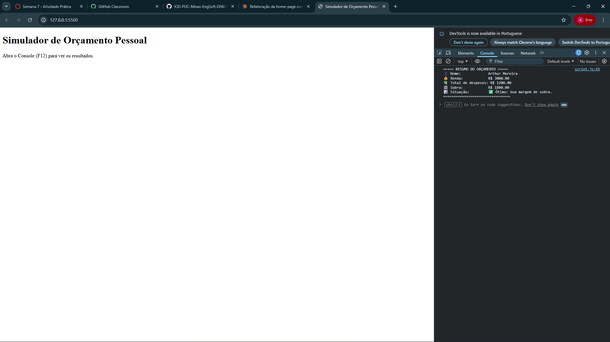

# Atividade Prática — JavaScript Básico

## Informações Gerais

- **Nome:** Arthur Moreira Figueiredo
- **Matrícula:** 909477

## Sobre o projeto

Simulador simples de orçamento pessoal desenvolvido em JavaScript puro. O script solicita nome, renda e despesas do usuário via `prompt()`, valida as entradas com `while`, lança as despesas com `for`, analisa o orçamento com `if/else` e exibe o resultado em `alert()` e `console.log()`.

## Print do Console (resultado da execução)

<< COLOQUE A IMAGEM AQUI >>

